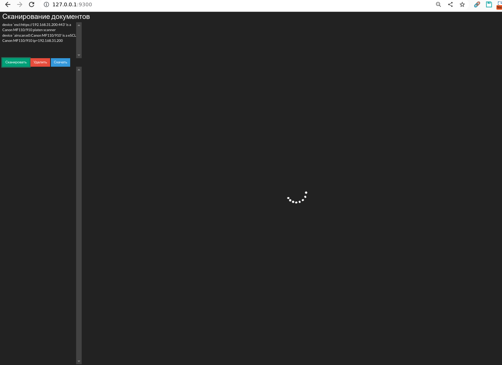

# ScanImage Server

Web application for scanning and managing documents using SANE/scanimage.

## Features

- Modern UI with Vue 3 + Tailwind CSS
- Dark and light themes
- Drag-and-drop image sorting
- PDF conversion (img2pdf)
- ZIP archive creation
- Responsive design for mobile devices
- Single executable (embedded frontend)

## Screenshot



## Requirements

### System Dependencies

- Go 1.21+
- Node.js 18+
- SANE (scanimage)
- img2pdf

### Installing Dependencies

```bash
# Ubuntu/Debian
sudo apt install sane-utils img2pdf

# Arch Linux
sudo pacman -S sane img2pdf

# macOS
brew install sane-backends img2pdf
```

## Installation

```bash
# Clone repository
git clone https://github.com/hightemp/wapp_scanimage_server.git
cd wapp_scanimage_server

# Install dependencies
make install

# Build
make build
```

## Running

### Development Mode

```bash
# Backend (Go server)
make dev

# Frontend (Vite dev server with hot reload) - in separate terminal
make dev-frontend
```

### Production

```bash
# Build and run
make run

# Or run the built binary
./bin/scanimage-server
```

## Configuration

The application is configured via environment variables or `.env` file:

```bash
# .env
DEBUG=1
SERVER_HOST=0.0.0.0
SERVER_PORT=8080

# Frontend dev server (optional)
VITE_PORT=3000
VITE_BACKEND_PORT=8080
```

### Backend

| Variable | Description | Default |
|----------|-------------|---------|
| DEBUG | Debug mode | false |
| SERVER_HOST | Server host | 0.0.0.0 |
| SERVER_PORT | Server port | 8080 |

### Frontend (development mode)

| Variable | Description | Default |
|----------|-------------|---------|
| VITE_PORT | Vite dev server port | SERVER_PORT or 3000 |
| VITE_HOST | Vite dev server host | 0.0.0.0 |
| VITE_BACKEND_PORT | Backend port for proxy | SERVER_PORT or 8080 |
| VITE_BACKEND_HOST | Backend host for proxy | SERVER_HOST or localhost |

Frontend automatically uses `SERVER_PORT` and `SERVER_HOST` from the root `.env` to configure proxy to backend.

## API

### Scanners

- `GET /api/scanners` - List of scanners
- `GET /api/scanners/raw` - Raw output of scanimage -L
- `POST /api/scan` - Perform scan

### Scans

- `GET /api/scans` - List of scanned files
- `DELETE /api/scans` - Delete all scans
- `DELETE /api/scans/:name` - Delete scan
- `PUT /api/scans/:name` - Rename scan
- `POST /api/scans/batch` - Batch operations
- `PUT /api/scans/order` - Update file order

### Archives

- `GET /api/archives` - List of archives
- `POST /api/archives` - Create archive
- `POST /api/archives/all` - Archive all scans
- `DELETE /api/archives` - Delete all archives
- `DELETE /api/archives/:name` - Delete archive

### PDF

- `GET /api/pdfs` - List of PDF files
- `POST /api/pdfs` - Create PDF from selected
- `POST /api/pdfs/all` - Convert all to PDF
- `DELETE /api/pdfs` - Delete all PDFs
- `DELETE /api/pdfs/:name` - Delete PDF

### Settings

- `GET /api/settings` - Get settings
- `PUT /api/settings` - Update settings

## Project Structure

```
.
├── cmd/server/          # Go application entry point
│   ├── main.go
│   └── dist/            # Built frontend (embedded)
├── internal/
│   ├── config/          # Configuration
│   ├── database/        # SQLite
│   ├── handlers/        # HTTP handlers
│   ├── models/          # Data models
│   └── services/        # Business logic
├── frontend/            # Vue 3 application
│   ├── src/
│   │   ├── components/  # Vue components
│   │   ├── stores/      # Pinia stores
│   │   ├── api/         # API client
│   │   └── types/       # TypeScript types
│   └── ...
├── files/
│   ├── scanned/         # Scanned images
│   ├── archives/        # ZIP archives
│   └── pdf/             # PDF files
├── data/                # SQLite database
└── Makefile
```

## Technologies

### Backend
- Go 1.21+
- Gin (web framework)
- SQLite (modernc.org/sqlite - pure Go)

### Frontend
- Vue 3 (Composition API)
- TypeScript
- Tailwind CSS
- Pinia (state management)
- Vite (build tool)
- vuedraggable (drag-and-drop)

## License

MIT
