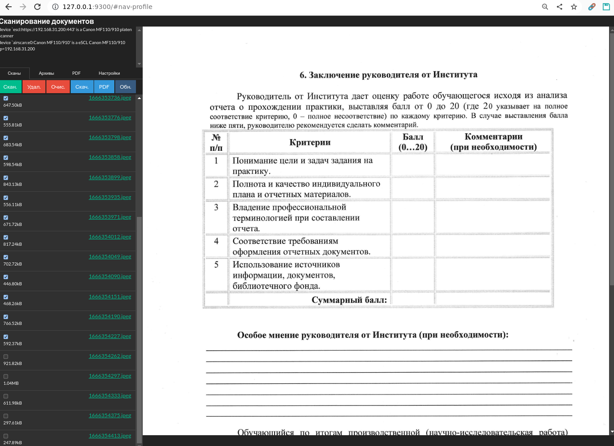

# ScanImage Server

Веб-приложение для сканирования и управления документами с помощью SANE/scanimage.

## Особенности

- Современный интерфейс на Vue 3 + Tailwind CSS
- Темная и светлая тема
- Drag-and-drop сортировка изображений
- Конвертация в PDF (img2pdf)
- Создание ZIP-архивов
- Адаптивный дизайн для мобильных устройств
- Один исполняемый файл (embedded frontend)

## Скриншот



## Требования

### Системные зависимости

- Go 1.21+
- Node.js 18+
- SANE (scanimage)
- img2pdf

### Установка зависимостей

```bash
# Ubuntu/Debian
sudo apt install sane-utils img2pdf

# Arch Linux
sudo pacman -S sane img2pdf

# macOS
brew install sane-backends img2pdf
```

## Установка

```bash
# Клонирование репозитория
git clone https://github.com/hightemp/wapp_scanimage_server.git
cd wapp_scanimage_server

# Установка зависимостей
make install

# Сборка
make build
```

## Запуск

### Режим разработки

```bash
# Backend (Go сервер)
make dev

# Frontend (Vite dev server с hot reload) - в отдельном терминале
make dev-frontend
```

### Production

```bash
# Сборка и запуск
make run

# Или запуск собранного бинарника
./bin/scanimage-server
```

## Конфигурация

Приложение настраивается через переменные окружения или файл `.env`:

```bash
# .env
DEBUG=1
SERVER_HOST=0.0.0.0
SERVER_PORT=8080
```

| Переменная | Описание | По умолчанию |
|------------|----------|--------------|
| DEBUG | Режим отладки | false |
| SERVER_HOST | Хост сервера | 0.0.0.0 |
| SERVER_PORT | Порт сервера | 8080 |

## API

### Сканеры

- `GET /api/scanners` - Список сканеров
- `GET /api/scanners/raw` - Сырой вывод scanimage -L
- `POST /api/scan` - Выполнить сканирование

### Сканы

- `GET /api/scans` - Список отсканированных файлов
- `DELETE /api/scans` - Удалить все сканы
- `DELETE /api/scans/:name` - Удалить скан
- `PUT /api/scans/:name` - Переименовать скан
- `POST /api/scans/batch` - Пакетные операции
- `PUT /api/scans/order` - Обновить порядок файлов

### Архивы

- `GET /api/archives` - Список архивов
- `POST /api/archives` - Создать архив
- `POST /api/archives/all` - Архивировать все сканы
- `DELETE /api/archives` - Удалить все архивы
- `DELETE /api/archives/:name` - Удалить архив

### PDF

- `GET /api/pdfs` - Список PDF файлов
- `POST /api/pdfs` - Создать PDF из выбранных
- `POST /api/pdfs/all` - Конвертировать все в PDF
- `DELETE /api/pdfs` - Удалить все PDF
- `DELETE /api/pdfs/:name` - Удалить PDF

### Настройки

- `GET /api/settings` - Получить настройки
- `PUT /api/settings` - Обновить настройки

## Структура проекта

```
.
├── cmd/server/          # Точка входа Go приложения
│   ├── main.go
│   └── dist/            # Собранный frontend (embedded)
├── internal/
│   ├── config/          # Конфигурация
│   ├── database/        # SQLite
│   ├── handlers/        # HTTP handlers
│   ├── models/          # Модели данных
│   └── services/        # Бизнес-логика
├── frontend/            # Vue 3 приложение
│   ├── src/
│   │   ├── components/  # Vue компоненты
│   │   ├── stores/      # Pinia stores
│   │   ├── api/         # API клиент
│   │   └── types/       # TypeScript типы
│   └── ...
├── files/
│   ├── scanned/         # Отсканированные изображения
│   ├── archives/        # ZIP архивы
│   └── pdf/             # PDF файлы
├── data/                # SQLite база данных
└── Makefile
```

## Технологии

### Backend
- Go 1.21+
- Gin (web framework)
- SQLite (modernc.org/sqlite - pure Go)

### Frontend
- Vue 3 (Composition API)
- TypeScript
- Tailwind CSS
- Pinia (state management)
- Vite (build tool)
- vuedraggable (drag-and-drop)

## Лицензия

MIT
